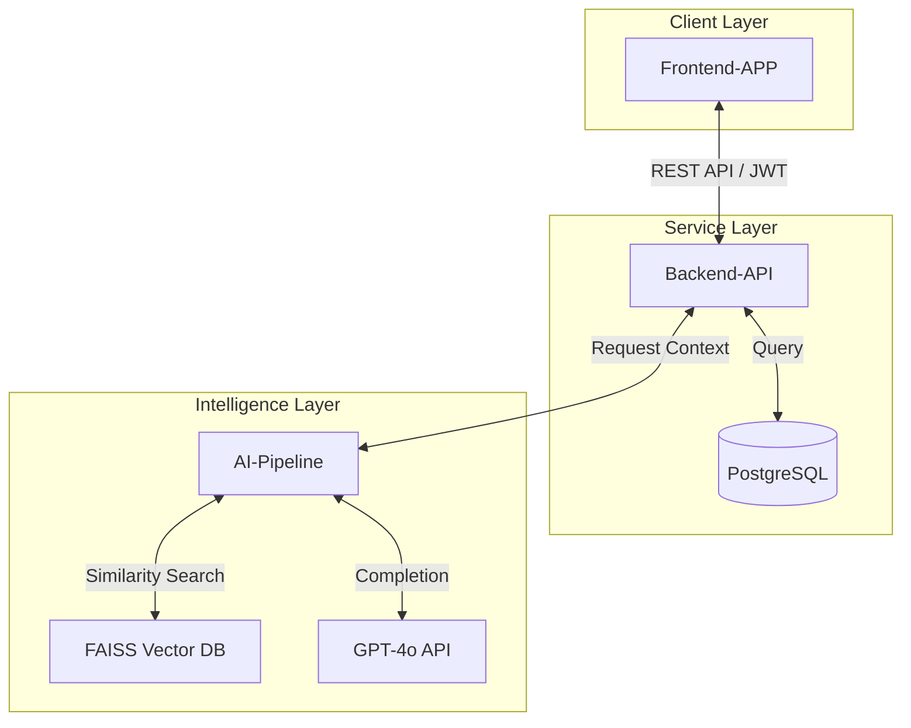

# 🚀 멋사 로켓단
### "강의 소스에서 지능형 학습 경로를 추출하는 AI 학습 보조 플랫폼"

방대한 강의 자료(STT 스크립트)와 커리큘럼 데이터를 기반으로, 학습자에게 최적화된 **맞춤형 퀴즈**와 **지능형 학습 가이드**를 자동으로 생성하는 엔드투엔드 솔루션을 구축합니다.

---

## System Architecture (시스템 구조)

---

## Repositories & Roles (리포지토리 역할)

### 1. [Frontend-APP](https://github.com/Mutsa-Rocketdan/Frontend-APP) 
- **역할**: 강의 업로드 인터페이스, 실시간 AI 작업 대시보드, 인터랙티브 퀴즈 풀기 및 결과 리포팅.
- **기술**: React 18, Vite, TypeScript, Tailwind CSS.

### 2. [Backend-API](https://github.com/Mutsa-Rocketdan/Backend-API) 
- **역할**: JWT 기반 인증(OAuth), 데이터 영속성 관리, AI 파이프라인 연동 및 작업 상태 트래킹.
- **기술**: FastAPI, PostgreSQL, SQLAlchemy, Docker, Cloudflare Tunnel.

### 3. [AI-Pipeline](https://github.com/Mutsa-Rocketdan/AI-Pipeline) 
- **역할**: STT 텍스트 임베딩, 강의 지식 베이스(VectorDB) 구축, GPT-4o 기반의 맞춤형 퀴즈 및 가이드 자동 생성 메커니즘.
- **기술**: OpenAI GPT-4o, FAISS, Sentence-Transformers, Streamlit.

---

## Main Tech Stack (공통 기술 스택)

| Category | Technology |
| :--- | :--- |
| **Frontend** | React, TypeScript, Vite, Tailwind CSS |
| **Backend** | FastAPI, PostgreSQL, SQLAlchemy, Alembic |
| **AI/ML** | OpenAI API, FAISS, Sentence-Transformers, LangChain |
| **DevOps** | Docker, Docker Compose, Sentry, Prometheus, Grafana |
| **Networking** | Cloudflare Tunnel (trycloudflare.com) |

---

## Getting Started (전체 시스템 실행 방법)

전체 시스템을 로컬 환경에서 구동하려면 다음 순서대로 진행하는 것을 권장합니다.

1. **AI-Pipeline 설정**: 강의 스크립트 데이터를 임베딩하여 VectorDB를 최초 구축합니다.
2. **Backend-API 실행**: Docker Compose를 이용해 데이터베이스와 API 서버를 함께 구동합니다.
3. **Frontend-APP 실행**: 백엔드 API 주소를 설정한 뒤 개발 서버를 구동하여 접속합니다.

---

## Team Mutsa-Rocketdan
우리는 기술을 통해 학습의 장벽을 낮추고, 쏟아지는 강의 데이터 속에서 핵심 지식을 빠르게 습득할 수 있는 경로를 제시합니다.
